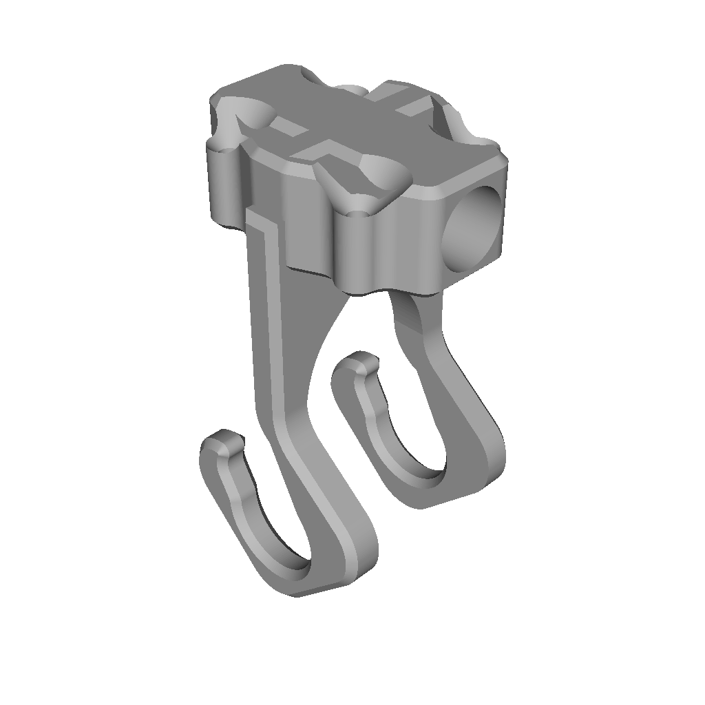

## Because sometimes ... you just need that thumbnail

### How it Works

- input.stl **in** 
- output.png **out**

### Prerequisites

To run this project, you need:

- Go 1.16 or higher
- The following Go libraries:
  - `github.com/fogleman/fauxgl`
  - `github.com/hschendel/stl`

### Example Output

